# What does this guide make?

This guide is to set up hoshinova on a VPS and then transfer anything
that has been downloaded to your local storage at a more convenient. In
my case it was so that I could download all the streams to my local
server overnight while I was sleeping so that my network wasn't affected
with a potentially large amount of streams. Additionally, this VPS will
also host a wireguard server for accessing the webUI of hoshinova. The
wireguard server will not be limited to just this, and you can use it as
a VPN for other devices as well.

# Why is \*something\* done like this?

-   This guide is more than likely not the best and most efficient way
    to do things. It works and I was requested to share the setup.

-   I wanted to use a containerized setup because I can limit the
    resources it can consume

-   I didn't want to modify the hoshinova code so that I don't have to
    worry about updates if/when some much brighter minds than myself
    release them.

# Disclaimers:

1.  This guide uses linux as the local machine. It should work perfectly
    fine in windows as rsync and ssh are on windows and are not exotic
    programs, but you will have to adapt them.

2.  If you have better configs for any of the programs, use it. This is
    meant for starting from scratch.

3.  I will use a local virtual machine for all of the OS config, simply
    because I don't want to risk my current setup or buy another
    service. This also means that for initial setups might not be
    exactly the same as mine.

4.  Processing the videos (i.e. muxing) takes a LONG time. For the type
    of setup this guide is going for, it is not an issue, but if there
    are a few videos muxing and a crash occurs it is possible videos
    will process on youtube and hoshinova won't redownload it.

5.  Your mileage may vary, especially when choosing hosting.

# Who do I host with?

I personally use a 1GB ram dedicated kvm slice from buyvm/frantech
(https://buyvm.net/kvm-dedicated-server-slices/) and added on a 256gb
storage slab. The 512mb ram option should also work with this guide, but
is currently either out of stock or no longer sold.

For the 1GB kvm slice, it is currently \$3.50 USD/month as of 20/10/23.
The block storage is priced at \$5 USD/TB/month, but offer it in 256GB
and 512GB. As I have 256GB, this costs me \$1.25 USD/month.

In total I pay \$4.75 USD/month for the service, which I believe is a
good price for unmetered network bandwidth at gigabit speeds and pretty
good customer service. When I did initially purchase the slab, I got
denied, but talking to customer service solved this very quickly.

You can choose whatever location works best for you, providing there is
stock. You need to buy the KVM slice and the block storage separately,
and make sure they are from the same location. If you have a domain, you
have the option to add it to your kvm slice as well as other addon
options. You don't need the automated backups if you don't want as you
can keep up to 5 snapshots of your system at a time.

# OS of choice

For the operating system I will be using DietPI (<https://dietpi.com/>).
DietPi was made for SBCs running on your home network and is a very
light distribution of Debian. It comes with many utilities that make it
a lot easier to do some common things in linux and comes with a software
installer with many config templates. There are some changes we will
make to some configs later as this is a public facing VPS and not a
local network raspberry pi.

For the VPS, we will download the native for PC Bios version.


# Setting up the VPS

After you have purchased your kvm slice and block storage, you can head
over to the "Stallion" manager.


Head over to the "Storage Volumes" tab and click the cog. Select attach
to virtual server and select the kvm slice you just purchased

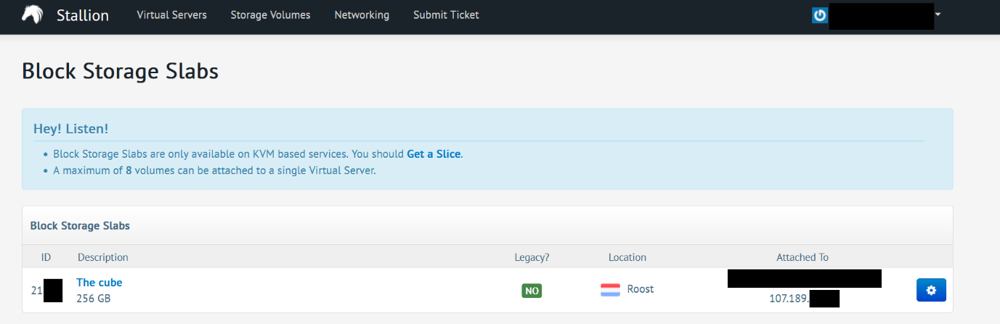

Go back to the virtual servers tab and click manage, you will be granted
a similar screen

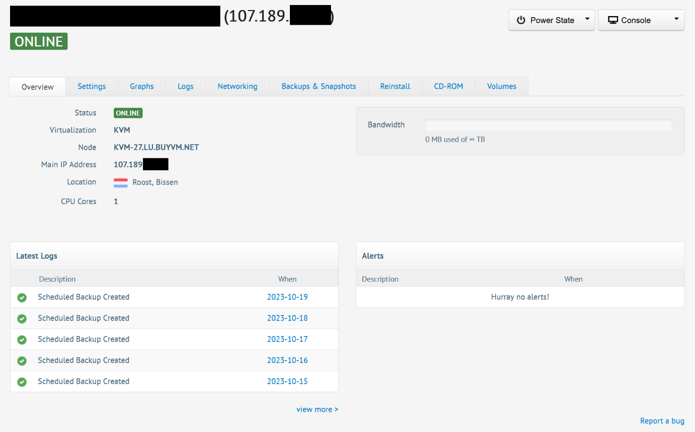

If you check the volumes tab you can see the attached storage volume. Go
to the CD-ROM Upload ISO. For the DietPi installer, we will need to
extract the ISO file and upload it to somewhere where we can get a
direct download link (i.e. the link ends in .iso). It can be a pain
because redirects and non-direct links will not work, but only needs to
be done once so expiring files are fine. I've had success using
<https://filelu.com> and getting the link from the final download button
after uploading.

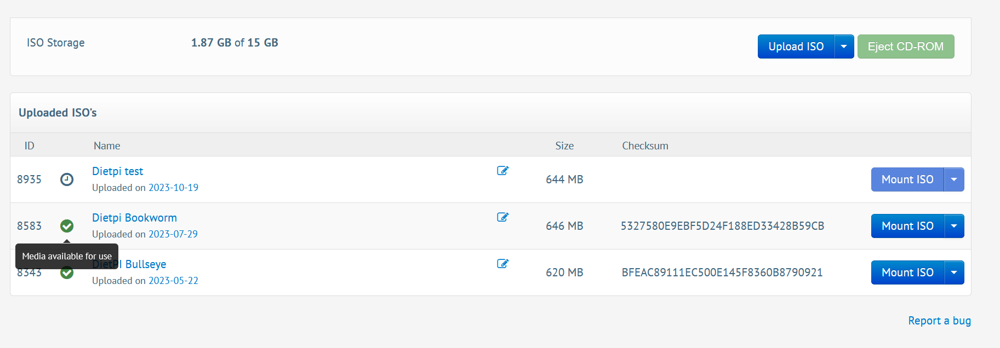

After it has finished uploading, you will want to go to Power State
Boot. Then go to Console Web based console, to bring up a virtual
console for the install process.

# Installing DietPi

Installation is pretty simple, on the initial screen select install
dietpi


Ensure, that you install DietPi on the kvm slice storage and not the
block storage. Mine may be named differently to yours.


Let DietPi install and it will turn off the machine. After that happens,
boot it again.

# Setting up DietPi

Since it expects to be run on a local network, you will more than likely
be able to ssh to the kvm slice immediately using the IP. If not, you
will need to use the virtual console. Log in with the default username:
root and default password: dietpi. Once logged in it will apply any
updates that are available.

If you get an error message relating to updates/install, choose the
subshell option.

Once that is complete, you will need to set a new password. If you are
in the virtual console and not ssh, I HIGHLY recommend you set a
temporary basic password, as the default keyboard will always be a UK
layout.

Disable the serial/uart console since we won't need it.

## DietPi Software

Once the DietPi-Software page appears, we will first want to go down and
press enter on the DietPi-config

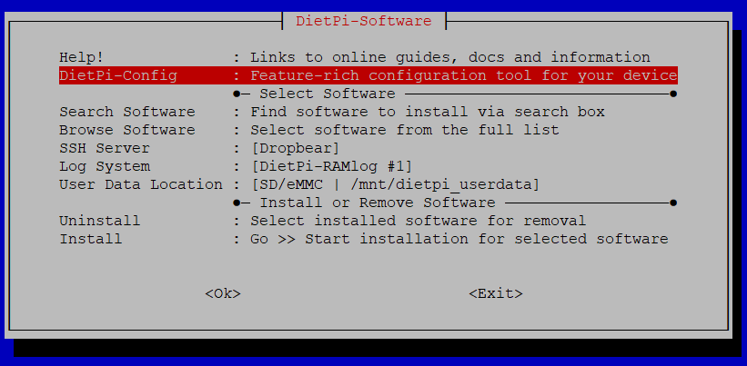

**If you are accessing via virtual console and not ssh**

It is important to set the keyboard layout to what you have, as it will
sometimes change the characters you actually put in for the password. If
you connect over SSH later, the SSH session will use YOUR keyboard
layout, not the virtualized keyboard from the virtual console.

Go to language/regional options and press enter on the keyboard: \[gb\].
Select the same Generic 105-key pc, press enter on other, and choose
English US. Go up to the one that just says English (US) with no extra
options. If your keyboard layout is not US, choose the appropriate one.


Then go to security options passwords and go through the dialog options
like the first time.

**Back to everyone**

Go to the network adapters menu


Ethernet


And press enter in change mode to set it to static. The buyvm VPSes have
a static IP address. Then press enter on Copy Current address settings
to static

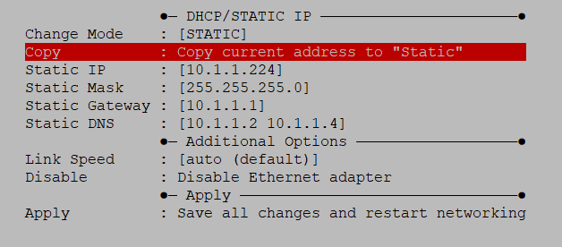

Change the DNS options as you choose.

Press apply yes and OK on the purge WiFi related packages, as we don't
need them

Press esc until you return to the DietPi-Software Menu.

From here, we will be installing the following software:

-   Docker

-   Pi-Hole (optional)

-   Unbound (optional)

-   OpenSSH server

For docker you can wither go through the browse software list, or search
for "docker". Press space with the docker (162) highlighted, and it will
come up with a \*, indicating it will install. If searched for, hit
confirm to return to the menu. We will not need compose for this setup.


Next, find Pi-hole, press space to mark it and confirm. It will prompt
you to also install unbound, press yes. Since we already set a static
IP, we will hit skip on the prompt to set one.

Then go down to the SSH server, press enter and choose OpenSSH. We will
use this for SFTP later when we set up rsync

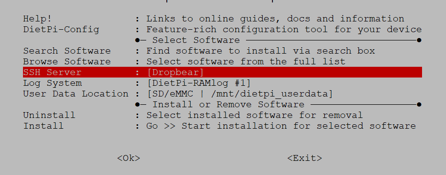

Then scroll down to Install and hit enter. You should be presented with
the following screen:


Press ok if it looks similar the programs will install. It may prompt
you for a webserver for Pi-Hole, so choose one that best suite your
needs. Pi-Hole will need interaction for the initial install, please
refer to the docs at <https://pi-hole.net/> but the defaults should work
fine for this.

When trying to set this up on my virtual machine at home (not the VPS) I
sometimes had issues with grub not wanting to go onto the virtual disk.
To fix this, you can install the Debian 12 template or install Debian
with the available iso on Stallion then follow the guide here:
<https://dietpi.com/docs/hardware/#make-your-own-distribution>

# Setting up users and SSH keys

For something public facing, it is highly recommended to use SSH keys
instead of a password, and then disabling passwords for SSH
authentication. We will also be creating a user specifically for
hoshinova, which we will use to connect to the server for rsync.

To create the user we will run: ```useradd -m hoshi```

This will create a user and a home directory for it. We will need the
home directory for the SSH keys.

Then we use ```passwd hoshi``` to set a password, make a decent password.

Finally, we add the hoshi user to the docker group with ```usermod -a -G docker hoshi``` so docker can have
access to the folders.


If you have open-SSH installed on your local machine, you will be able
to user ssh-copy-id and it will easily copy over your SSH key to the
VPS. For more information and options with ssh keys, go to
<https://www.ssh.com/academy/ssh/copy-id>

If you don't have ssh-copy-id or are on a windows machine this might
help you: <https://gist.github.com/andrezrv/8132876>

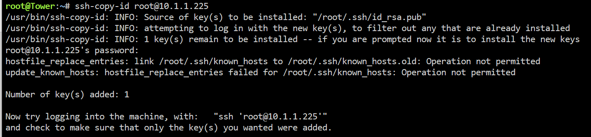

When we try to SSH into the server, we will not have to enter the
password.

Logout and repeat for the hoshi user.


Once again, check you can log in without being prompted for a password.

After we confirm we can log into both accounts without a password, we
will change some setting for SSH to disable password login. Log back
into the root account.

First we will edit the dietpi custom configuration to disable its
changes with ```nano /etc/ssh/sshd_config.d/dietpi.conf```. Use crtl+x, then y
then enter to save.


Put a hash at the beginning of each line to disable the options

Now we will edit the default settings with ```nano /etc/ssh/sshd_config```

We will add two lines near the top of the file:

```
PasswordAuthentication no

PubkeyAuthentication yes
```


PubkeyAuthentication is set to yes by default, but we will make sure it
is explicitly set just in case.

Finally, we will run ```systemctl restart ssh sshd``` to restart the SSH
service. I haven't had it stop my current session before, but it may for
you.

# Installing wireguard and a firewall

## Installing UFW

First we will install UFW, a firewall for linux to make sure we don't
accidentally expose our hoshinova port or any other service we may run
on the VPS in the future.

Simply run ```apt update && apt install ufw```

Now we will set two rules initially. First run ufw default deny to deny
any incoming connection except ones allowed. Then allow ssh using ```ufw
allow ssh``` OR ```ufw allow 22```. If you use a custom port for SSH, use your
SSH port.

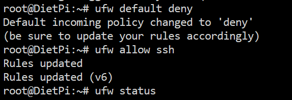

We will now start the firewall with ```ufw enable```. We can check the status
with ufw status verbose


Despite it saying it is enabled on startup, I've found it not
necessarily the case, so enable the service with ```systemctl enable ufw```

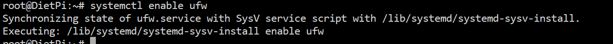

## Installing wireguard

We will use wireguard as a secure tunnel to view the web ui of hoshinova
as it is unwise to expose that to the public. You can also use OpenVPN
or ipsec if you choose, but you will have to set them up yourself. It
also makes use of the VPS connection so you can use it as a VPN for
anything use you want. We will use PiVPN as it acts as a very basic
manager for our VPN.

To install PiVPN, use the install script from their website: ```curl -L
https://install.pivpn.io | bash```

Some of you may have notices PiVPN is also included in the dietPi
software list. We won't be using that as it resists using UFW. Since
there is very little changes the PiVPN template from dietPi affects, we
will just use the proper installer.

Allow the installer to run the interactive installer, set your setting
as you desire. It will ask you for a user to install OpenVPN configs,
just choose any, but choose wireguard on the next step if you intend to
stick to the guide.

If you installed pihole earlier, it will detect the installation. Press
yes if you have.

Continue going through the steps. The prompts explain what each of the
options are pretty well, so use your judgement for what works best for
you. When it asks if you want to reboot, select yes and re-login once
the VPS has rebooted.

I found that the default ufw rules don't properly allow machines
connected to wireguard to properly access the hoshinova web-ui. I ended
up setting a rule to allow all on the wireguard interface (wg0) since
I'd be using the connection for more than just hoshinova. I used ```ufw
allow in on wg0``` to do this. If you only want hoshinova, it may be best
just to allow the port 1104.

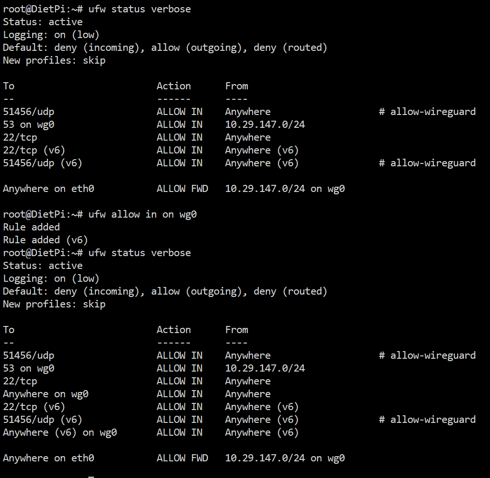

To add a client to PiVPN, simply use ```pivpn -a```

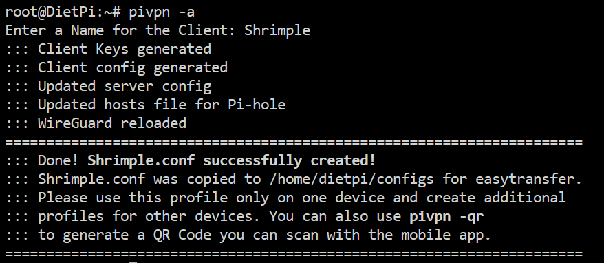

The configs will be stored in the directory it displays and in
/etc/wireguard/configs

# Setting up the block storage

Up until now, everything has been running and installing onto the SSD
storage the buyvm VPS has, which for these services is the best option.
Now that we are setting up the storage for hoshinova, we will need to
mount the block storage.

In the console, type ```dietpi-drive_manager```. This will pull up the drives
manager utility that comes with dietpi.


Here we can see our block storage drive. It may be different for you. If
you didn't unmount the iso file, it will also be visible. Hit enter with
the block storage device selected.


We will format the block storage device. Set the partition table and
format to what works best for you. The default options will work fine
for this setup.


Give it a name that you'll remember.


Now we will create a couple of folders for the hoshinova container to
use.

We will run:
```
mkdir -p /mnt/hoshiblock/hoshinova/temp

mkdir -p /mnt/hoshiblock/hoshinova/config

mkdir -p /mnt/hoshiblock/hoshinova/Done

mkdir -p /mnt/hoshiblock/hoshinova/scripts
```
We will need to change the owner of these folders and set the required
permissions.

To set the owner run: ```chown -R hoshi /mnt/hoshiblock/hoshinova/```

To set the permissions run: ```chmod -R 770 /mnt/hoshiblock/hoshinova/```

The permissions allow the owner and group, i.e. the hoshi user and the
docker group, full access to the files and folders in the directory.

I've had issues in the past with docker creating files not respecting
the owner or group, which make them unable to be accessed by docker or
for the user to use. To solve this problem, I run a cronjob regularly as
root to ensure the permissions are always set every 10 minutes. It
simply runs the two commands above. Run the cronjob editor with ```crontab
-e```.

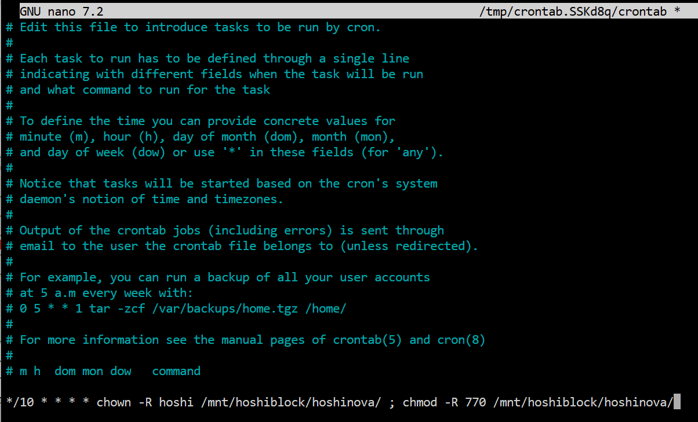

Save the cronjob. In regards to permissions, we will assume that this
script will take care of them for the scripts going forward. If you move
through quickly, simply re-run the commands where you have issues.

# Setting up the docker container

Switch to the hoshi user with ```su hoshi```.

We will need to create a config file for hoshinova, as the mapping we
use later will create a folder if the file does not exist. Create a file
with ```nano /mnt/hoshiblock/hoshinova/config/config.toml``` and import a
config file. You can use my config <https://github.com/CanOfSocks/hoshinova-vps-guide/blob/main/example-config-vps.toml> to get all holo en. You can
use my pervious config at home <https://github.com/CanOfSocks/hoshinova-vps-guide/blob/main/example-config-home.toml> for examples of how to use
description filters too. Save the config.

The docker command also includes a cookies file. Similarly, create it
with ```nano /mnt/hoshiblock/hoshinova/config/cookies.txt``` and paste in your
cookies.txt file.

Then run the docker command:
```
docker run -d --name='Hoshinova' --net='host' --cpus=".75" -e TZ="Australia/Sydney" -e HOST_CONTAINERNAME="Hoshinova" -v '/mnt/hoshiblock/hoshinova/config/config.toml':'/app/config.toml':'rw' -v '/mnt/hoshiblock/hoshinova/temp/':'/app/temp':'rw' -v '/mnt/hoshiblock/hoshinova/Done/':'/app/videos':'rw' -v '/mnt/hoshiblock/hoshinova/config/cookies.txt':'/app/cookies.txt':'rw' --restart always 'ghcr.io/holoarchivists/hoshinova:main'
```
We set the network to "host" because docker has a nasty habit of
bypassing UFW as it uses iptables, where the rules for docker proceed
the ufw rules. The simplest way is to use the host system settings and
ufw then works fine.

The cpu usage is also limited to 75% so that the system does not get
bogged down when hoshinova muxes streams. This won't greatly affect the
performance of hoshinova with the whole system's limits. Remember, this
is about getting it done *eventually*, not quickly.

At this point, you should be able to connect to the server with a
wireguard client. Once there, enter the IP address of the gateway for
the wireguard server in your browser at port 1104. Below is mu current
instance.

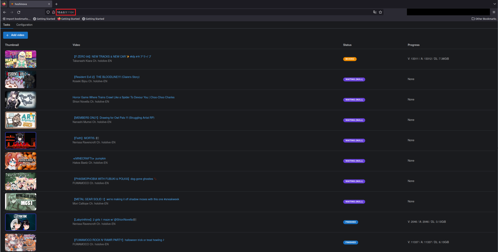


# Setting up the folder mover

For the mover we will use a filesystem monitor to monitor when files
enter our done directory, specifically inotify-tools' inofitywait.

We first install inotify tools with: ```apt update && apt install inotify-tools.```

## The script

As you may have noticed, we did not include the scripts folder in the
hoshinova docker mappings. This is because we will use this folder to
store our scripts for monitoring the output folder for finished files,
then moving across the thumbnail file and description file that
hoshinova does not move across natively.

Switch to the root user with ```su root``` and enter the password for your
root user. Now we will use ```nano /mnt/hoshiblock/hoshinova/scripts/moveFolder.sh```.

Enter the script below and save:

#!/bin/bash
```
#!/bin/bash
inotifywait --recursive --monitor --format "%w%f" --includei '.*\.mp4$' --includei '.*\.mkv$' \
--event modify,moved_to,create,move_self /mnt/hoshiblock/hoshinova/Done  \
| while read changed; do
    echo "File ${changed} moved to Done directory"
    folder="${changed%.*}"
    name=$(basename "${folder}")
    echo "Moving ${name} to ${folder}"
    mv "/mnt/hoshiblock/hoshinova/temp/${name}" "${folder}" && \
    mv "${changed}" "${folder}"
done 
```

This script will detect when a mp4 file has been moved to or
created/copied to the done folder that hoshinova points to, and moves
the folder of the same name into the done directory, then move the mp4
into that. Thankfully, hoshinova gets rid of all the temp files before
moving the final file, so it is pretty clean. However, it is likely that
if failures occur the old temp files from previous attempts may be
brought across to the final folder.

You could add ```--includei '.*\.mkv$'``` to the inotifywait command and
it should detect mkv files as well (I only tried this when writing the
guide and am waiting for results).

Make the script executable with ```chmod +x /mnt/hoshiblock/hoshinova/scripts/moveFolder.sh```.

## Running as a service

Now we will setup a service to run our mover script on startup and to
restart the script if it ever fails/finishes for some reason.

Create a file with ```nano /mnt/hoshiblock/hoshinova/scripts/moveFolder.service```

And enter:

```
[Unit]
Description=Hoshinova Folder Mover
After=docker.service
StartLimitIntervalSec=0
[Service]
Type=simple
Restart=always
RestartSec=1
User=hoshi
ExecStart=/mnt/hoshiblock/hoshinova/scripts/moveFolder.sh
```

This will run the script after the docker service starts and will
restart the script if it fails.

Make the service executable with ```chmod +x /mnt/hoshiblock/hoshinova/scripts/moveFolder.service```

Now we will make a soft-link into the services folder with ```ln -s /mnt/hoshiblock/hoshinova/scripts/moveFolder.service /etc/systemd/system/hoshiMoveFolder.service```.

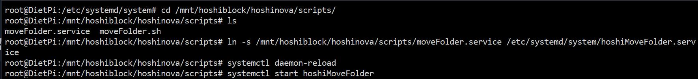


# Setting up clean ups

Sometimes things go wrong and the stream records can have an error. This
means that the final file doesn't get created and moved across, leaving
orphaned files in the temp directory.

Switch to the hoshi user with su hoshi and edit the cronjobs with
crontab -e. Add the following two commands to the crontab:

```
0 0 \* \* \* find /mnt/hoshiblock/hoshinova/temp/ --min-depth 1 -mtime +5 -delete

5 4 \* \* 2 find /mnt/hoshiblock/hoshinova/Done/ --min-depth 2 -mtime +14 -delete
```

These commands will find any files or folders that have not been
modified in 5 days for the temp folder, and 14 days for the Done folder.
You can change these values as you like, but anything sitting in either
folder for that long is almost certainly not going to move to where it
needs to.

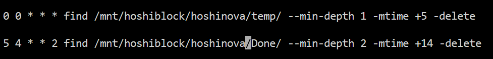
# Adding a swap file for dietPi

We will want to add a swap file for some extra ram capacity for when we
have many streams muxing at once. We want to use the SSD storage on the
boot disk on the VPS.

We will check the current disk usage with ```df -h```:


Here we can see we have about 16GB available on the boot disk, in my
case /dev/sda. On my VPS I have a 4GB swap file setup, but you could
double that if you want.

When logged into the root account, go to dietpi-drive_manager.

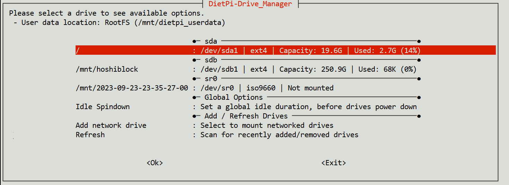

Go into the settings of the boot disk and edit the swap file. There
should already be a swap file if you have less than 2GB of ram in your
VPS


Change the value to 4096


Let the manager reconfigure things.

# Setting up rsync

We will use rsync to pull the files when our local storage server is
ready to do so. I have set up rsync to run each hour between midnight
and 6am as everyone in my house is usually asleep, you can set the
schedule to what you like, but I would recommend at least once a day.
Since we are using sftp as our transfer protocol, we can make use of the
SSH keys we made earlier

Since this is your own server, I won't dictate where you put your
scripts. Since I personally use unraid for storage, I'll be using the
userscripts plugin.

The script is as follows:

```
#!/bin/bash
if pidof -x -o $$ $0 > /dev/null
then
    exit
fi


rsync -arv --partial --delay-updates --remove-source-files   hoshi@10.1.1.225:/mnt/hoshiblock/hoshinova/scripts/Done/* /mnt/user/HoloArchive
chown -R archive /mnt/user/HoloArchive
```

As I run this multiple times a night, the if statement at the start
checks if the script is already running, and will exit if it is.

I won't explain what each flag does, but essentially, all the folders in
the Done directory of the hoshinova docker are copied from the VPS to
the local storage, and deleted once they have been copied. I haven't had
the script fail to work correctly yet, so it should work for you,
substituting the IP address and destination folder for those used in
your setup.

Finally, I used a chown command to make sure everything in the folder
has the right owner.

# Roll archive script (optional)

Since my storage is finite and I'm not interested in keeping a full
archive of everyone I have in my hoshinova config forever, I setup a
couple of scripts to check the availability of my archived videos and
delete them if they are publicly available. I made sure to filter our
member videos. It does require that you name the folders with a specific
pattern, with mine focusing on the video ID at the end of the file name
surrounded by curved brackets (). If you want things from harbour, be
careful.

The script also comes with filters and description filters, like in
hoshinova, to keep videos that you want regardless of availability.

The checking availability plugin is:

```
#!/bin/bash
file="${1}"
vidTrim="${file##*(}"
vidID="${vidTrim%)*}"

echo "Checking status of ${vidID}"

response=$(curl -s -I -o /dev/null -w "%{http_code}" "https://www.youtube.com/oembed?format=json&url=https://www.youtube.com/watch?v=${vidID}")

publicCode="200"

memberFlag="Members Only"
titleFilters="${memberFlag}|asmr|unarchive|karaoke|unarchived|no archive|WATCH-A-LONG|WATCHALONG|watch-along|birthday|offcollab|off-collab|off collab|SINGING|Gawr Gura Ch. hololive-EN"
descriptionFilters="gura|UCoSrY_IQQVpmIRZ9Xf-y93g"

if [ "$response" = "$publicCode" ]; then
	descriptionFile="${file%.*}.description"
	if ! basename "${file}" | grep -Eiq "${titleFilters}" && ( ! [ -f "${descriptionFile}" ] || ! grep -Eiq "${descriptionFilters}" "${descriptionFile}" ); then
		#Ensure no previous output can poison checks
		rm -f /tmp/archiveCheck
		curl -s -o /tmp/archiveCheck "https://www.youtube.com/watch?v=${vidID}" 
		
		if ! grep -Eiq "${memberFlag}" /tmp/archiveCheck; then			
			echo "Video with ID ${vidID} is public and doesn't match filters, removing..."
			rm -f "$file"
		else
			echo "Video with ID ${vidID} is a membership stream, keeping..."
		fi
		rm -f /tmp/archiveCheck
	else
		echo "Video with ID ${vidID} is public, but matches filters, keeping..."
	fi
else
    echo "Video with ID ${vidID} is not publicly accessible (Code: ${response}) or matches filters, keeping..."
fi

sleep 5
```

Additionally, I set this to only run on files modified between 30 and 60
days old, which I ran with a find script that also deletes any empty
folders.
```
#!/bin/bash
find /mnt/user/HoloArchive/ -mindepth 1 -type f -not -path '*/.*' -mtime +30 -mtime -60 -exec /mnt/user/appdata/HoloArchive/Scripts/checkPublic.sh "{}" \;
find /mnt/user/HoloArchive/ -mindepth 2 -empty -type d -delete

```

Switch out the locations and times as you desire for your setup. I have
set this to run weekly, but it has not run through full testing due to
how recently this setup has been in action.
